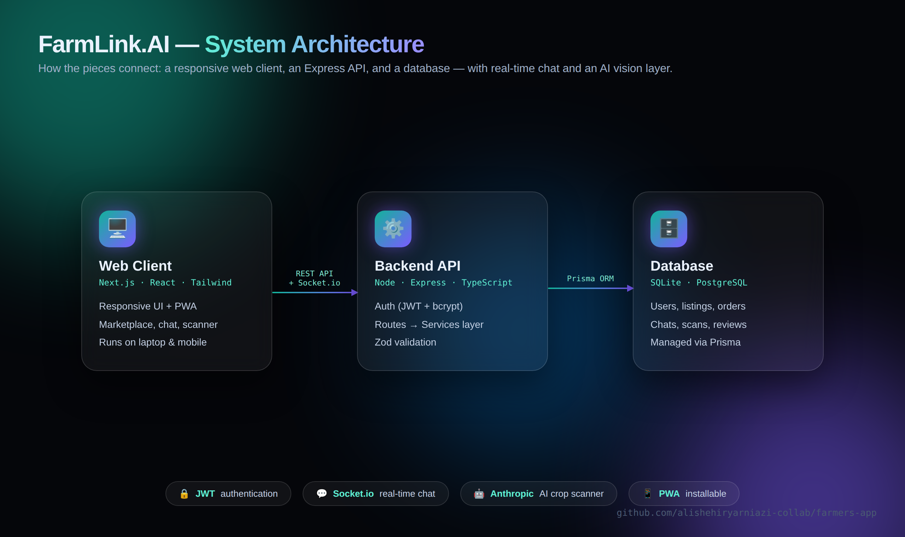

<h1 align="center">🌿 FarmLink.AI</h1>

<p align="center">
  A full-stack platform that connects <b>farmers</b> and <b>buyers</b> — with an AI crop-disease
  scanner, a direct marketplace, and real-time chat.
</p>

<p align="center">
  
  
  
  
  
</p>

---

## Overview

FarmLink.AI is a project I built to learn full-stack development by making something real, not just
following a tutorial. It lets farmers photograph a crop to get an AI disease diagnosis, list their
produce for sale, and chat directly with buyers — all in one responsive web app that also installs on a
phone like a native app. It's still a work in progress, and I keep improving it.

## Architecture



The app is split into three parts: a **Next.js** web client, an **Express** API, and a database accessed
through **Prisma**. Real-time chat runs over **Socket.io**, and the crop scanner calls the **Anthropic**
vision API.

## Features

- 🤖 **AI crop-disease scanner** — upload or photograph a crop and get a diagnosis with treatment advice.
- 🛒 **Direct marketplace** — farmers list produce; buyers browse and order directly.
- 💬 **Real-time chat** between buyers and farmers (Socket.io).
- 🔐 **Auth** with email *or* phone number (JWT + bcrypt).
- 🔔 **Notifications**, guidelines, reviews, and recurring orders.
- 📋 **Inventory / catalog** for farmers to manage their listings.
- 📱 **Installable PWA** — works on laptop and mobile from one codebase.

## Tech Stack

| Layer      | Technologies                                             |
| ---------- | -------------------------------------------------------- |
| Frontend   | Next.js (App Router), React, TypeScript, Tailwind CSS    |
| Backend    | Node.js, Express, TypeScript                             |
| Database   | Prisma ORM — SQLite (dev), PostgreSQL-ready (production) |
| Realtime   | Socket.io                                                |
| AI         | Anthropic API (vision) for the disease scanner           |
| Auth       | JWT, bcrypt                                              |
| Validation | Zod                                                      |

## Getting Started

### Quick start (Windows)
Double-click **`start-app.bat`** — it launches the backend and the web app in separate windows.
Then open <http://localhost:3000>. (`stop-app.bat` stops them.)

### Manual
**Backend** — http://localhost:4000
```bash
cd backend
npm install
npx prisma migrate dev
npx tsx prisma/seed.ts   # loads starter content
npm run dev
```

**Web** — http://localhost:3000
```bash
cd web
npm install
npm run dev
```

> **AI scanner:** it needs an Anthropic API key. Add `ANTHROPIC_API_KEY=...` to `backend/.env` to enable
> it. Without a key, the scanner returns a clear "not configured" message and every other feature still
> works normally.

## Project Structure

```
farmers-app/
├── backend/          Express API (TypeScript + Prisma)
│   └── src/
│       ├── routes/       API endpoints
│       ├── services/     business logic
│       ├── middleware/   auth + error handling
│       └── prisma.ts     database client
├── web/              Next.js frontend
│   └── src/
│       ├── app/          pages (App Router)
│       ├── components/   reusable UI
│       └── lib/          API client, contexts
└── docs/             diagrams & assets
```

## Notes

- Built to be deployment-ready: switch the Prisma provider to `postgresql` and set `DATABASE_URL` to run
  on a hosted database in production.
- Next up: adding automated tests and a live demo.

## Author

**Ali Sharyar Khan** — BS Information Technology student, learning full-stack development in public.
📫 alishehiryarniazi@gmail.com
